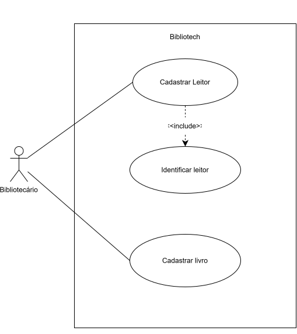
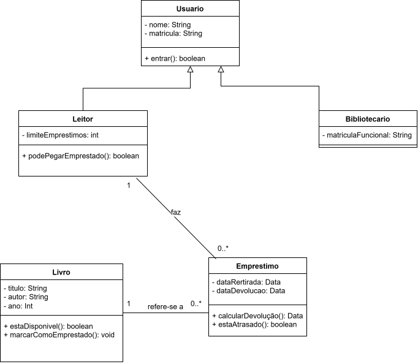

# BiblioTech

Sistema de empréstimo de livros para a biblioteca do campus.

## 1. O projeto

O BiblioTech é um sistema para organizar o acervo e os empréstimos da biblioteca do campus. A bibliotecária precisa controlar os livros e saber quem está com cada exemplar, enquanto os leitores precisam consultar a disponibilidade dos livros sem precisar ir até o balcão.

## 2. Histórias de usuário

| # | História de usuário |
|---|---|
| HU01 | Como leitor, quero consultar a disponibilidade de um livro, para saber se posso pegá-lo emprestado sem ir até o balcão. |
| HU02 | Como leitor, quero devolver um livro, para não ficar com pendência na biblioteca. |
| HU03 | Como bibliotecária, quero registrar um empréstimo, para saber quem está com cada exemplar. |
| HU04 | Como bibliotecária, quero cadastrar um livro novo, para que ele possa ser encontrado no sistema. |
| HU05 | Como bibliotecária, quero ver os empréstimos atrasados, para cobrar a devolução. |
| HU06 | Como leitor, quero reservar um livro que está emprestado, para ser o próximo a retirá-lo quando ele voltar. |

## 3. Requisitos

### Requisitos funcionais

| # | Requisito funcional | Veio da |
|---|---|---|
| RF01 | O sistema deve permitir que a bibliotecária cadastre um livro no acervo. | HU04 |
| RF02 | O sistema deve permitir que a bibliotecária cadastre um leitor. | Regra de acesso: só quem tem cadastro leva livro |
| RF03 | O sistema deve permitir que o leitor consulte a disponibilidade de um livro. | HU01 |
| RF04 | O sistema deve permitir que a bibliotecária registre a devolução de um livro. | HU02 |
| RF05 | O sistema deve permitir que a bibliotecária registre o empréstimo de um livro. | HU03 |
| RF06 | O sistema deve permitir que o leitor reserve um livro emprestado. | HU06 |

### Requisitos não funcionais

| # | Requisito não funcional |
|---|---|
| RNF01 | A consulta de disponibilidade deve responder em menos de 3 segundos. |
| RNF02 | Somente usuários identificados como bibliotecários podem alterar o acervo. |

## 4. Diagramas (feitos em APS)

### Casos de uso



### Classes



### Decisão: Bibliotecario–Emprestimo

A associação será **Bibliotecario 1 — 0..* Emprestimo**.

Um bibliotecário pode registrar vários empréstimos ao longo do tempo.  
Cada empréstimo fica associado a um bibliotecário responsável pelo registro.

### Diagrama de classes em Mermaid

```mermaid
classDiagram
    class Usuario {
        -String nome
        -String matricula
        +boolean entrar()
    }

    class Leitor {
        -int limiteEmprestimos
        +boolean podePegarEmprestado()
    }

    class Bibliotecario {
        -String matriculaFuncional
    }

    class Livro {
        -String titulo
        -String autor
        -int ano
        +boolean estaDisponivel()
        +void marcarComoEmprestado()
    }

    class Emprestimo {
        -Data dataRetirada
        -Data dataDevolucao
        +Data calcularDevolucao()
        +boolean estaAtrasado()
    }

    Usuario <|-- Leitor
    Usuario <|-- Bibliotecario
    Leitor "1" -- "0..*" Emprestimo : faz
    Livro "1" -- "0..*" Emprestimo : refere-se a
    Bibliotecario "1" -- "0..*" Emprestimo : registra 


